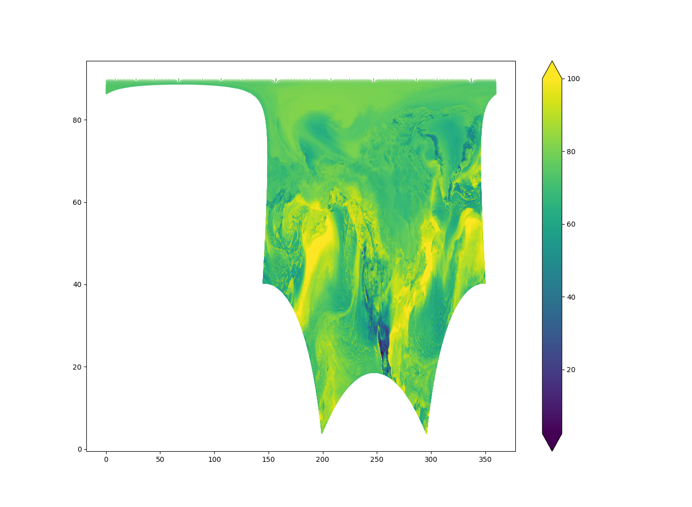
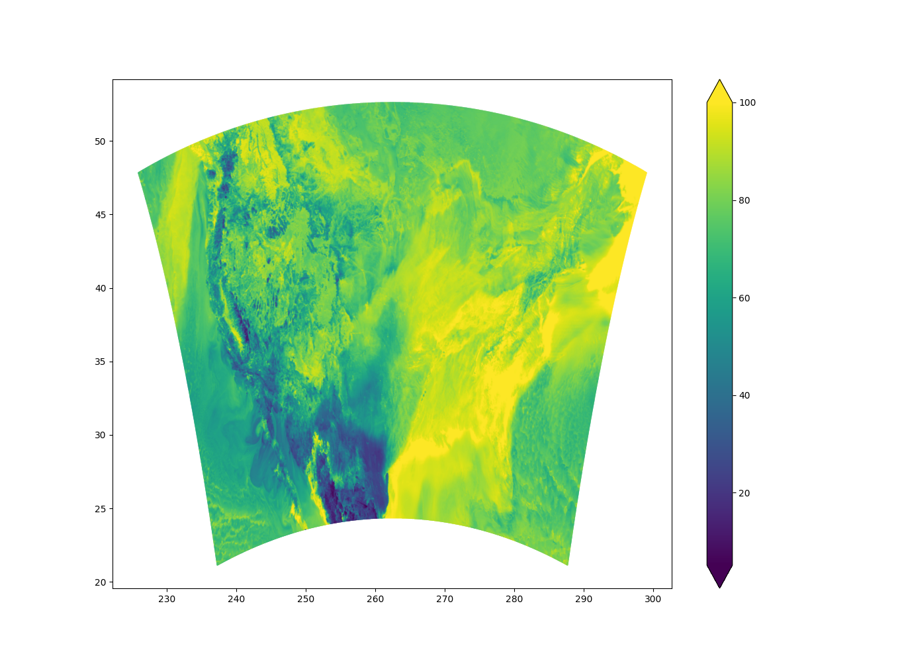

# interp
A simple RBF interpolation utility considering only k nearest neighbors.
It uses the [nanoflann](https://github.com/jlblancoc/nanoflann) library (header only) for nearest neighbor search.
`nanoflann` comes included with the distribution so it is technically not a dependency.

    Interpolate fields from one grid onto another grid or scattered locations using grib2/text/binary formats.
    
    Example:
        OMP_NUM_THREADS=8 ./interp -i rrfs_a.t06z.bgdawpf007.tm00.grib2 -t rrfs.t06z.prslev.f007.ak.grib2 -f 0,3
    
    This example performs interpolation of fields 0 and 3 using 8 threads from the North American domain to the Alaska grid.
    
    usage: ./interp [-h] [--input INPUT] [--output OUTPUT] [--template TEMPLATE]
                         [--clusters-per-rank CLUSTERS_PER_RANK] [--fields FIELDS]
                         [--neighbors NEIGHBORS] [--neighbors-interp NEIGHBORS_INTERP]
                         [--rbf-shape RBF_SHAPE] [--use-cutoff-radius USE_CUTOFF_RADIUS]
                         [--cutoff-radius CUTOFF_RADIUS] [--cutoff-radius-interp CUTOFF_RADIUS_INTERP]
    
    arguments:
      -h, --help               Show this help message and exit.
      -i, --input              Input file in grib or other text/binary format containing coordinates and fields for interpolation.
      -o, --output             Output file in grib or other text/binary format containing the result of the interpolation.
      -t, --template           Template grib or other text/binary file on which the output file will be based.
      -c, --clusters-per-rank  Number of point clusters (point clouds) per MPI rank
      -f, --fields             Comma-separated list of field indices in the grib file to be interpolated.
                               Use hyphens (-) to indicate a range of fields (e.g., 0-3 for fields 0, 1, 2).
                               Use a question mark (?) to indicate all fields.
      -n, --neighbors          Number of neighbors to be used during the solution for weights using source points.
      -ni, --neighbors-interp  Number of neighbors to be used during the interpolation at target points.
      -r, --rbf-shape          Shape factor for the RBF (Radial Basis Function) kernel.
      -ucr, --use-cutoff-radius      Use a cutoff radius instead of fixed number of nearest neighbors.
      -cr, --cutoff-radius           Cutoff radius used during the solution.
      -cri, --cutoff-radius-interp   Cutoff radius used during interpolation.
      -r, --rbf-smoothing      Smoothing factor for RBF interpolation.
      -m, --monomials          Number of monomials (0 or 1 supported).
      -a, --average-duplicates Average duplicate entries in input files.
      -h, --header             Provide three integers for the total number of source points, target points and fields in the input files.
                                  e.g. --header 12000 24000 1
                               In this case, the ouput file will have no headers as well.
      -utf, --use-test-field   Use a test field function for initializing fields. This applies even if input is read from a file.
                               It can be useful for tuning parameters with the L2 error interpolation from ground truth.

The most important parameters affecting performance and accuracy are `--rbf-shape`, `--neighbors` and `--neighbors-interp`.
The RBF shape factor if automatically set if you don't provide one, however, you may want to tune that value later.
The number of neighbors is set to 1 by default, meaning a non-parameteric version, which is very fast since it does not
solve a linear system of equations. This is similar to inverse distance weighting interpolation. 
Increase the number of neighbors progressively to see how it affects the error of interpolation.
The number of neighbors used during actual interpolation `--neighbors-interp` has some effect on performance, although
not as much as `--neighbors`. In general the more neighbors used, the smoother the interpolation.

## Requirements
- [C++ Eigen library](https://eigen.tuxfamily.org/dox/)
- [ECMWF eccodes library](https://github.com/ecmwf/eccodes) - build with `-DENABLE_PNG`

## Build

    mkdir build && cd build
    cmake -DCMAKE_BUILD_TYPE=release ..
    make && make install

If you don't need grib2 support via eccodes

    cmake -DCMAKE_BUILD_TYPE=release -DENABLE_GRIB=OFF ..

To compile for 3D interpolation

    cmake -DCMAKE_BUILD_TYPE=release -DENABLE_GRIB=OFF -DENABLE_3D=ON ..

## Run

To interpolate from the North-American(NA) domain to the conus domain, we should provide the input grib file and a sample template
grib file containing the conus grid lat/lon. We can select fields to interpolate by providing comma-separated list with 0-based index.
For this example, fields UGDR:VGDR:TMP:RH:APCP are selected with their 0-based index in the NA grib file.

    $ OMP_NUM_THREADS=2 ./interp -i rrfs_a.t06z.bgdawpf007.tm00.grib2 -t rrfs.t06z.prslev.f007.conus_3km.grib2 -f 16,17,751,754,771
    Threads: 2
    ===== Parameters ====
    numDims: 2
    numNeighbors: 1
    numNeighborsInterp: 32
    rbfShape: 0
    useCutoffRadius: false
    cutoffRadius: 0.08
    cutoffRadiusInterp: 0.64
    numClustersPerRank: 2
    rbfSmoothing: 0
    monomials: 0
    =====================
    Eigen will be using 1 threads.
    Reading input grib file
    Finished in 3.98184 secs.
    Reading interpolation grid from grib file
    Finished in 0.331067 secs.
    ===== Data size ====
    numPoints: 14452641
    numTargetPoints: 1905141
    numFields: 5
    =====================
    Clustering point clouds into 1 clusters
    Completed 1 iterations.
    cluster 0 with centroid (246.751 41.7439) and 14452641 points
    Finished in 0.105573 secs.
    Clustering point clouds into 2 clusters
    Completed 25 iterations.
    cluster 0 with centroid (294.837 41.6794) and 7238878 points
    cluster 1 with centroid (198.499 41.8086) and 7213763 points
    Finished in 3.28064 secs.
    Automatically computed shape factor: 69.455
    ===========================
    Computing weights for all fields
    Automatically computed shape factor: 68.9903
    ===========================
    Computing weights for all fields
    Interpolating fields
    Interpolating fields
    Finished in 1.04203 secs.
    Finished in 3.23271 secs.
    Writing input and output fields for plotting
    Finished in 21.4104 secs.

You can do some basic plotting with plot.py script

    $ python3 plot.py -h

    usage: plot.py [-h] --input INPUT --output OUTPUT [--3d]
    
    options:
      -h, --help            show this help message and exit
      --input INPUT, -i INPUT
                            Path to input text file
      --output OUTPUT, -o OUTPUT
                            Path to output png file
      --3d, -3              Indicates if the input file uses 3d coordinate

To plot interpolation result over the conus domain

    $ python3 plot.py -i output.txt -o conus.png

We can also plot the NA input domain

    $ python3 plot.py -i input.txt -o na.png

The plotting script will plot all interpolated fields. Here is the plot of relative humidity (RH)
over the North-American(NA) and Conus grid resp. The odd-looking NA domain is due to the domain
crossing the north pole.

  
  

# To do

- [X] Add regularization to high-order RBF interpolation
- [X] Process multiple clusters per mpi rank to increase usability of direct solvers
- [X] Make iterative solver BiCGstab robust
- [X] Add NetCDF/HDF5 reading/writing capability for input/output resp
- [X] Add max iterations or tolerance stopping for iterative solvers
- [X] RBF with radius search gives symmetric matrix but difficult to chose threshold?
- [X] Direct solvers upto 3 neighbors very fast probably due to TDMA
- [X] Investigate banded matrix solvers
